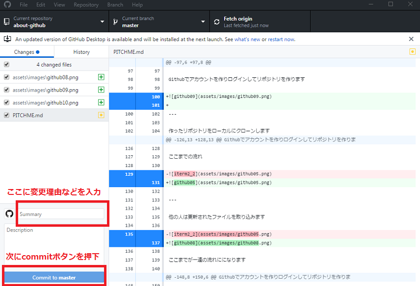
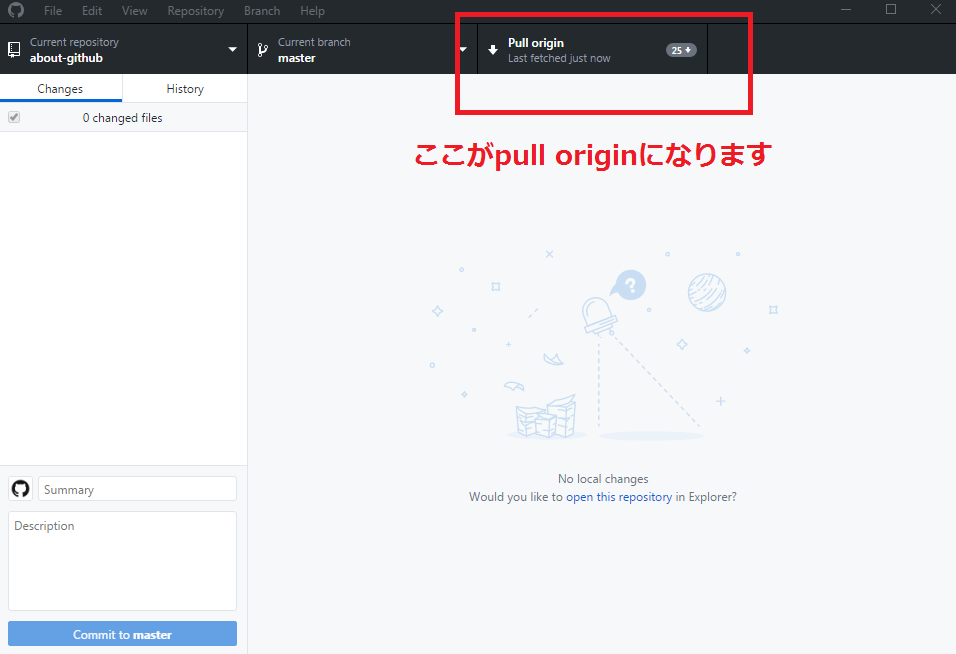

---?image=assets/images/github00.jpg
<h1 class="fc_white bold ta_center">Githubを使って ワークフローを 進化させよう</h1>

企画制作部 
那須 毅康

---

## Agenda

- 「Githubってそもそもなに??」
- 「Githubってどうやって使うの???」

---

## **「Githubってそもそもなに??」**

---

例えばこんなことありませんか?

<h3 class="fc_white">仕様書を更新するたびに バックアップファイルを共有ドライブに残す</h3>

<ul>
<li class="fragment visible" data-fragment-index="0">バックアップファイルがどんどん増える<i class="em em-cold_sweat"></i>  <!-- --></li>
<li class="fragment visible" data-fragment-index="1">どれが最新ファイルなのかわからない<i class="em em-cold_sweat"></i>  <!-- --></li>
<li class="fragment visible current-fragment" data-fragment-index="2">誰が、どのような目的で修正したのかわからない<i class="em em-cold_sweat"></i>  <!-- --></li>
</ul>

---

<h3 class="fc_white">共有ドライブのファイルを間違えて 上書きしてしまった</h3>

<ul>
<li class="fragment visible" data-fragment-index="0">同じ名前のファイルが複数存在する(index.htmlとか)<i class="em em-confounded"></i>  <!-- --></li>
<li class="fragment visible current-fragment" data-fragment-index="1">一度上書きしたら元にもどせない<i class="em em-confounded"></i>  <!-- --></li>
</ul>

---

<h3 class="fc_white">ファイルを上書きしたら実は別の人が先に更新していた</h3>

<ul>
<li class="fragment visible" data-fragment-index="0">普段ローカルにダウンロードしファイルを修正している<i class="em em-dizzy_face"></i>  <!-- --></li>
<li class="fragment visible current-fragment" data-fragment-index="1">アップロードのたびに更新されてないか確認するのは手間だ<i class="em em-dizzy_face"></i>  <!-- --></li>
</ul>

---

## **「それGithubで解決できます!!」**

---

##### →仕様書を更新するたびに共有ドライブにバックアップファイルを残す

<ul>
<li class="fragment visible" data-fragment-index="0">ファイルの更新履歴をGithubが管理してくれます<i class="em em-smile"></i>  <!-- --></li>
<li class="fragment visible" data-fragment-index="1">しかも差分も簡単に確認できます<i class="em em-smile"></i>  <!-- --></li>
<li class="fragment visible current-fragment" data-fragment-index="2">誰が何の目的で変更したのかの記録も残せます<i class="em em-smile"></i>  <!-- --></li>
</ul>

---

##### →共有ドライブのファイルを間違えて上書きしてしまった

<ul>
<li class="fragment visible current-fragment" data-fragment-index="0">自分が編集したファイルのみ自動で更新してくれます<i class="em em-smiley"></i> <!-- --></li>
</ul>

---

##### →ファイルを上書きしたら実は別の人が先に更新していた

<ul>
<li class="fragment visible" data-fragment-index="0">他の人が編集した場合、差分を取り込むまで上書きできない仕組みです<i class="em em-blush"></i>  <!-- --></li>
<li class="fragment visible current-fragment" data-fragment-index="1">差分ファイルのみ自動で取り込んでくれます<i class="em em-blush"></i>  <!-- --><ul>
<li>どのファイルに差分があるかを探さなくてもいい<i class="em em-blush"></i>!</li>
</ul>
</li>
</ul>

---

## その結果

- **他の作業者に影響を与えずに、 自分の作業分を進めることができます** |
- **お互いの考えている経過が 見えるようになります** |
- **実物をみながら議論できます** |

---

## **「Githubってどうやって使うの???」**

---

### 「そもそも使いこなすのが難しんでしょ?」

- たしかにGithubを完全に使いこなすためには、それなりの学習コストが必要です
- でもコア機能であるファイル管理であれば簡単にはじめることができます

---

### Github Desktop

[https://desktop.github.com/](https://desktop.github.com/)

---

Githubでアカウントを作りログインしてリポジトリを作ります

---

---

作ったリポジトリをローカルにクローンします

---

---

---

ローカルでファイルを編集したらコミットします

---

それをGithubにプッシュします

---?image=assets/images/icarus.png

<h3 class="fc_white bold">ここでのポイントとして</h3>

- 編集したファイルのみ自動で更新されます |
- すでに他の人が更新していた場合は 差分を取り込むまでプッシュできません |

---?image=assets/images/icarus.png

プッシュしようとすると以下の画面が表示されます

---?image=assets/images/icarus.png

この場合、先にファイルを取り込む必要があります

---?image=assets/images/icarus.png

他の人は更新されたファイルを取り込みます

---?image=assets/images/icarus.png

そしてまたファイルを更新したらコミットしてプッシュします

<h3 class="fc_white bold">これが一連の流れになります</h3>

---

<h2 class="fc_white bold">その他の使い方</h3>

- 自作のsassやjsのコード置き場 |
- タスク管理やドキュメント管理 |
- プロダクト改善のアイデア出し |
- ちなみにこのスライドもGithubで管理しています |

---

<h2 class="fc_white bold">注意点</h2>

- リポジトリサイズは1GB以下(推奨) |
- 1ファイルのサイズ上限は100MB |
- wordやexcelなどのoffice製品は 差分の確認が不可能 |

---

<h2 class="fc_white bold">まとめ</h2>

### Githubは難しくありません。 まずはGithub Desktopを使ってドキュメントを管理しましよう
### プロジェクト管理ツールとしても使えます
### 何か不明点があればいつでも声をかけて下さい

---?image=assets/images/github00.jpg

<h1 class="fc_white bold">ありがとうございました</h1>
